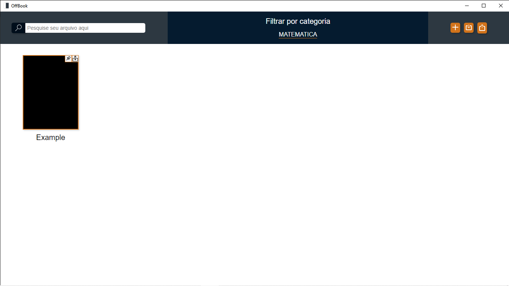

# Offbook

Offbook é um aplicativo desktop desenvolvido com Tauri, React e TypeScript. Ele fornece uma interface intuitiva para organizarPDFs de forma conveniente, permitindo aos usuários uma experiência melhorada na visualização de seus documentos.

## Funcionalidades Principais
- **Interface Intuitiva**: Uma interface de usuário simples e amigável para facilitar a navegação e a organização de seus PDFs.
- **Pesquisa Avançada**: Recursos de pesquisa poderosos para encontrar rapidamente o PDF desejado, incluindo pesquisa por texto e filtragem por categorias personalizadas.
- **Criação de Categorias**: Os usuários podem criar suas próprias categorias e atribuí-las aos PDFs para uma melhor organização.
- **Atribuição Múltipla de Categorias**: Os PDFs podem ser atribuídos a mais de uma categoria, permitindo uma organização flexível e detalhada da biblioteca.
- **Visualização Externa de PDFs**: Os PDFs são abertos utilizando o programa padrão do sistema, proporcionando uma experiência familiar aos usuários.

## Capturas de Tela
### Offbook - Home

## Requisitos do Sistema
- Node.js >= 12.x
- Rust (veja [rustup](https://rustup.rs/) para instalação fácil)

## Instalação
Para instalar o Offbook, siga estas etapas:

1. Clone este repositório: `git clone https://github.com/seu-usuario/offbook.git`
2. Navegue até o diretório do projeto: `cd offbook`
3. Instale as dependências: `npm install`
4. Inicie o aplicativo: `npm run tauri dev`

Feito por Vitor 👍 | [Veja meu Linkedin](https://www.linkedin.com/in/lem-vitor/)
